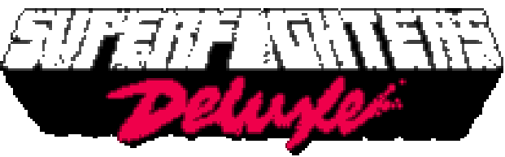

Modificacion "fanservice" que muestra algunas cosas del menú como se veía en versiones pasadas de [Superfighters Deluxe](https://store.steampowered.com/app/855860/Superfighters_Deluxe).

 
- Todo esta hecho a mi gusto personal.

> [!NOTA]
> Pueden haber errores que causen que el juego se crashee.

# CAMBIOS

#### VUELVE EL ANTIGUO POSICIONAMIENTO DEL LOGO
- Se omitio la animación del logo de SFD Steam y el logo de SFD Steam se posiciona en la esquina superior izquierda

#### VUELVE EL ESTILO DE LA PRE-ALPHA
- Ahora se dibuja `MenuLogo` al haber cargado SFD.

#### MENU MUSIC
- Se ha cambiado la música del menu por la que tenía anteriormente `SFDClassic`.

# PRECAUCIÓN
> [!ATENTO]
> Todos estos cambios estan hechos usando [SFDCT](https://github.com/Liokindy/SFDCT) como base, por lo cual si hay errores y/o bugs que no tienen nada que ver con el menú, eso sería algo que ya se escapa de mis manos y no me hago responsable por ello.  
> Al descargar esta versión el sistema lo detecta como una descarga maliciosa y no hay nada que pueda hacer para evitar eso. Por lo cual **NO SE RECOMIENDA** descargar esta versión en cualquier otro lugar que no sea en este repositorio.

# INSTALACIÓN

1. Descarga la [versión más reciente](https://github.com/pesadidya/SFDCT/releases/tag/SFD) y extrae los componentes en la carpeta raíz de Superfighters Deluxe. (`C:\Program Files (x86)\Steam\steamapps\common\Superfighters Deluxe`)

2. Anda a las Propiedas de SFD en Steam y escribe `cmd /k "%command%\..\SFDCT.exe"`. (Esto inicia un cmd que te permite escojer entre SFD, SFDCT y SFR. Si te molesta tener que escojer la version cada vez que abres el juego puedes escribir esto `cmd /k "%command%\..\SFDCT.exe -SFDCT"` para iniciar SFDCT sin tener que estar escojiendo a cada rato)

3. Ya esta listo con todo esto cada vez que inicies SFD Steam, iniciara con el mod SFDCT. 

# CREDITOS
Estas modificaciones fueron posible gracias a [SFDCT](https://github.com/Liokindy/SFDCT), las modificaciones hechas ahí me han encantando <3.
